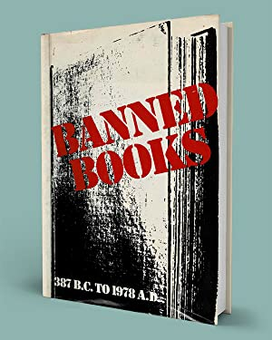
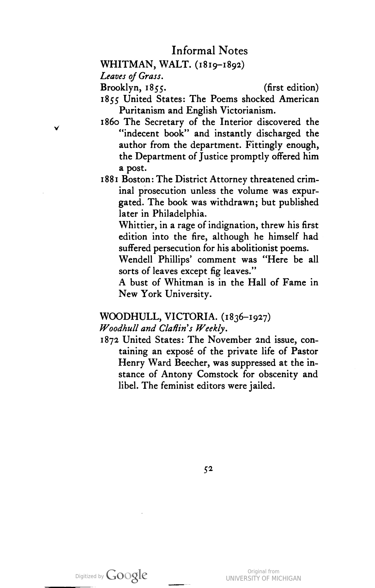
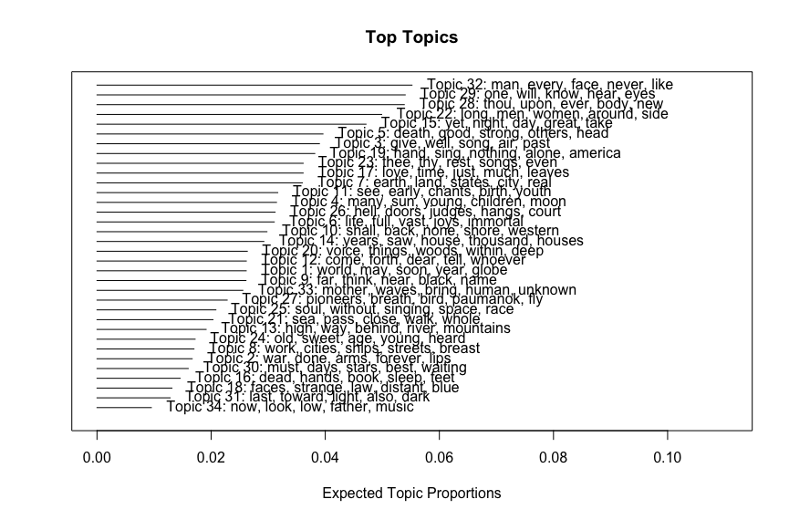
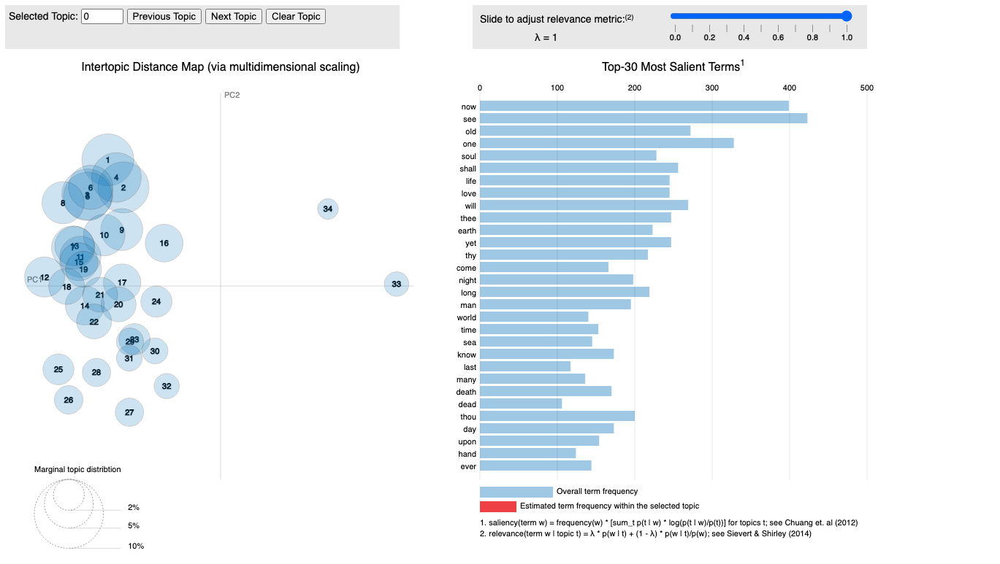
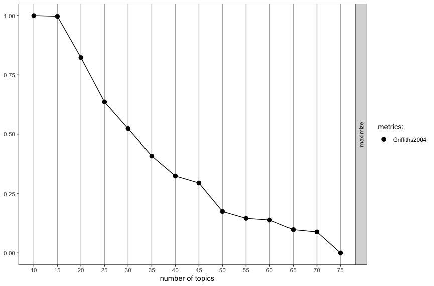
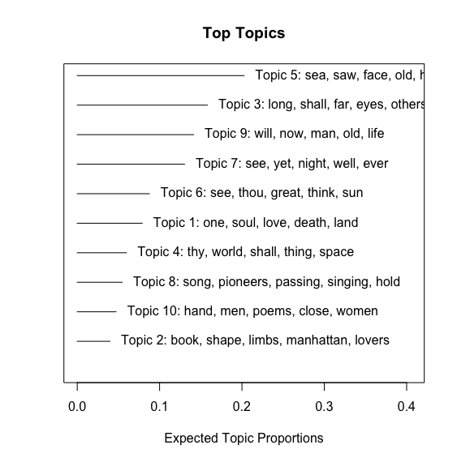
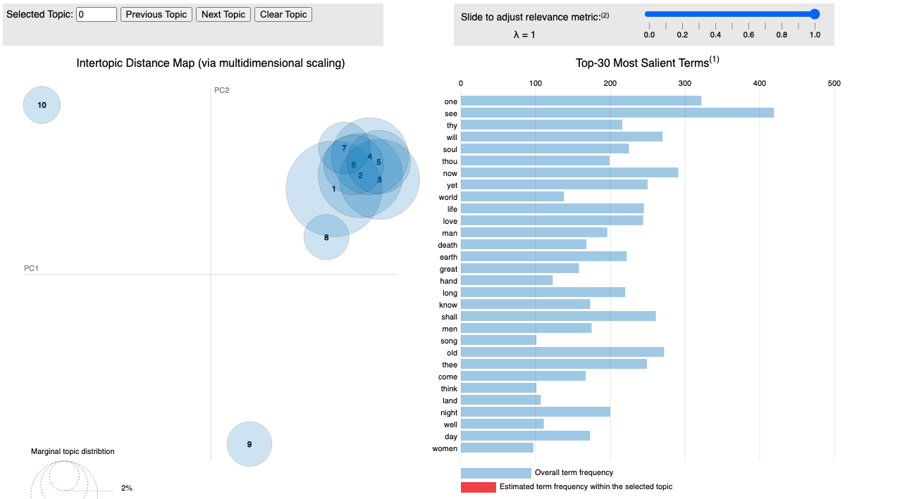
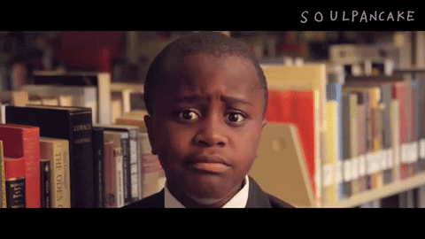

```{r setup, include=FALSE}
knitr::opts_chunk$set(echo = TRUE)
```

```{r, echo=FALSE, message=FALSE, warning=FALSE}
library(tidyverse)
library(tidytext)
library(wordcloud2)
library(forcats)
library(gutenbergr)
library(dplyr)
library(readtext) 
library(ggplot2)
library(SnowballC)
library(topicmodels)
library(stm)
library(ldatuning)
library(knitr)
library(LDAvis)
library(stringr)

# download the book
leaves_of_grass <- gutenberg_download(1322)

# divide into documents, each representing one chapter (or 'book' in the case of leaves of grass)
by_chapter <- leaves_of_grass %>%
  mutate(chapter = cumsum(str_detect(
    text, regex("^BOOK ", ignore_case = FALSE)
  ))) %>%
  ungroup() %>%
  filter(chapter > 0) %>%
  unite(document, chapter)

# split into words
by_chapter_word <- by_chapter %>%
  unnest_tokens(word, text) %>%
  anti_join(stop_words) 

# find document-word counts
word_counts_docs <- by_chapter_word %>%
  anti_join(stop_words) %>%
  filter(word != "thee") %>%
  filter(word != "thy") %>%
  filter(word != "thou") %>%
  count(document, word, sort = TRUE) %>%
  ungroup()
#stop words to filter out include: thee, thy, thou

#word_counts over all
word_counts <- by_chapter_word %>%
  anti_join(stop_words) %>%
  filter(word != "thee") %>%
  filter(word != "thy") %>%
  filter(word != "thou") %>%
  count(word, sort = TRUE) %>%
  ungroup()

### topi modeling ###
# chapters_dtm <- word_counts %>%
#   cast_dtm(document, word, n)
# 
# temp <- textProcessor(by_chapter$text, 
#                       metadata = by_chapter,  
#                       lowercase=TRUE, 
#                       removestopwords=TRUE, 
#                       removenumbers=TRUE,  
#                       removepunctuation=TRUE, 
#                       wordLengths=c(3,Inf),
#                       stem=FALSE,
#                       onlycharacter= FALSE, 
#                       striphtml=TRUE, 
#                       customstopwords=FALSE)
# meta <- temp$meta
# vocab <- temp$vocab
# docs <- temp$documents
# 
# stemmed_leaves <- by_chapter %>%
#   unnest_tokens(output = word, input = text) %>%
#   anti_join(stop_words, by = "word") %>%
#   filter(word != "thee") %>%
#   filter(word != "thy") %>%
#   filter(word != "thou") %>%
#   mutate(stem = wordStem(word))
# 
# stemmed_dtm <- by_chapter %>%
#   unnest_tokens(output = word, input = text) %>%
#   anti_join(stop_words, by = "word") %>%
#   filter(word != "thee") %>%
#   filter(word != "thy") %>%
#   filter(word != "thou") %>%
#   mutate(stem = wordStem(word)) %>%
#   count(word, stem, sort = TRUE) %>%
#   cast_dtm(word, stem, n)
# 
# chapters_lda <- LDA(chapters_dtm, k = 34, control = list(seed = 1234))
# 
# docs <- temp$documents
# meta <- temp$meta
# vocab <- temp$vocab
# 
# banned_stm <- stm(documents=docs,
#                   data=meta,
#                   vocab=vocab,
#                   K=34,
#                   max.em.its=25,
#                   verbose = FALSE)
# 
# banned_stm_10 <- stm(documents=docs,
#                      data=meta,
#                      vocab=vocab,
#                      K=10,
#                      max.em.its=25,
#                      verbose = FALSE)
# 
# k_metrics_chapters <- FindTopicsNumber(
#   chapters_dtm,
#   topics = seq(10, 75, by = 5),
#   metrics = "Griffiths2004",
#   method = "Gibbs",
#   control = list(),
#   mc.cores = NA,
#   return_models = FALSE,
#   verbose = FALSE,
#   libpath = NULL
# )
# 
# FindTopicsNumber_plot(k_metrics_chapters)
# #10 or 15
# 
# ### sentiment analysis ###
nrc <- get_sentiments("nrc")
sentiment_nrc <- inner_join(by_chapter_word, nrc, by = "word")

summary_nrc <- sentiment_nrc %>%
  count(sentiment, sort = TRUE) %>%
  spread(sentiment, n) %>%
  mutate(sentiment = positive - negative) %>%
  mutate(lexicon = "nrc") %>%
  relocate(lexicon)

# summary_nrc

nrc_counts <- sentiment_nrc %>%
  count(sentiment, sort = TRUE)

# nrc_counts

# nrc_counts %>%
#   mutate(sentiment = reorder(sentiment,n)) %>%
#   ggplot(aes(n, sentiment)) +
#   geom_col() +
#   labs(x = "NRC Sentiment", y = NULL) +
#   theme_minimal()

# ### 
# 
# ### bi-grams & tri-grams ###
whitman_bigrams <- leaves_of_grass %>%
  unnest_tokens(bigram, text, token = "ngrams", n = 2)

# whitman_bigrams %>%
#   count(bigram, sort = TRUE)

bigrams_separated <- whitman_bigrams %>%
  separate(bigram, c("word1", "word2"), sep = " ")

bigrams_filtered <- bigrams_separated %>%
  filter(!word1 %in% stop_words$word) %>%
  filter(!word2 %in% stop_words$word) %>%
  filter(word1 != "thou") %>%
  filter(word2 != "thou")  %>%
  filter(word1 != "walt")

bigram_counts <- bigrams_filtered %>%
  count(word1, word2, sort = TRUE)

# bigram_counts

# leaves_of_grass %>%
#   unnest_tokens(trigram, text, token = "ngrams", n = 3) %>%
#   separate(trigram, c("word1", "word2", "word3"), sep = " ") %>%
#   filter(!word1 %in% stop_words$word,
#          !word2 %in% stop_words$word,
#          !word3 %in% stop_words$word,
#          word1 != "thou",
#          word2!= "thou",
#          word1 != "walt") %>%
#   count(word1, word2, word3, sort = TRUE)
# 
# bigrams_united <- bigrams_filtered %>%
#   unite(bigram, word1, word2, sep = " ")

# bigrams_united


# ### quotes using filter() and grepl () ###
# whitman_quotes_love <- by_chapter %>%
#   select(text) %>% 
#   filter(grepl('love', text)) 
# 
# whitman_quotes_love <- sample_n(whitman_quotes, 10)
# 
# # whitman_quotes_love


```

## What I did

For my final project, I returned to Project Gutenberg and the question of banned books. Throughout the semester, I've been working with a corpus consisting of the top 20 most popular books on Project Gutenberg from Anne Haight's 1978 publication: *'Banned books: informal notes on some books banned for various reasons at various times and in various places'*

<center>

</center>

<center>https://catalog.lib.ncsu.edu/catalog/NCSU233622 </center>  


## Case Study: *Leaves of Grass*, by Walt Whitman

My original goal with my first independent analysis was to determine if there is indeed anything particularly risqué that shows up at the level of individual words in some commonly banned/challenged books. The results were intriguing, if pretty limited. I then appplied topic modeling methods in a subsequent analysis to see if a more nuanced analysis emerges, and wasn't really impressed with the results there either. In both cases, I determined that looking at so many disparate books at once was really muddying my results.

This time, then, I decided to focus on a single banned book as a case study: *Leaves of Grass* by Walt Whitman. 

<center>

</center>

## What's so bad about some leaves and grass anyway? 
Whitman's contemporaries definitely didn't see this book as mere detritus. I was able to get ahold of the full text of *Banned Books* via [HathiTrust](https://www.hathitrust.org/), and here are Anne Haight's notes on *Leaves*:
<center>
{width=50%}
</center>

An online exhibition from UVA: ["Censored: Wielding the Red Pen"](https://explore.lib.virginia.edu/exhibits/show/censored/walkthrough/bowdlerized), provides further context: 

> Walt Whitman's Leaves of Grass created an uproar from the moment it was first published in 1855 and all through its subsequent nine editions. This classic work of poetry was deemed "obscene," "too sensual," and "shocking" because of its frank portrayal of sexuality and its obvious homoerotic overtones. In 1865, Whitman lost his job as a clerk with the Department of the Interior, when his supervisor found the annotated copy, on display, among Whitman's possessions at work. In 1870, Yale University President Noah Porter compared Whitman's offense in writing Leaves of Grass to that of "walking naked through the streets." With the single known exception of the Library Company of Philadelphia, libraries refused to buy the book, and the poem was legally banned in Boston in the 1880s and informally banned elsewhere. Most booksellers agreed to neither publicize nor recommend Leaves of Grass to customers, and in 1881, the Boston District Attorney threatened Whitman's publisher with criminal prosecution, at the urging of the Society for the Suppression of Vice, causing a proposed new edition to be withdrawn from publication.

>In this whirlwind of condemnation, a few voices spoke up in favor of the poem. From the very outset, Ralph Waldo Emerson recognized the work's genius, calling Leaves "the most extraordinary piece of wit and wisdom that America has yet contributed."

## Purpose/Research Questions

With these things in mind...

**Purpose:**   
To experiment with text mining methods to see if they can surface any of the notions for which Whitman was apparently shunned for in his works. 

**Research Questions:**  
 - Does anything saucy emerge at the word count/frequency level?  
 - What about at the topic level using LDA?  
 - Might we see some naughty bi-grams or tri-grams? 

## Methods

- Basic word counts and frequencies
- Topic modeling using LDA
- Sentiment analysis w/ NRC
- Bi-grams + tri-grams
- Selected quotes using filtering + grepl

## Basic word counts

A look at the basic word counts produces about what one would expect: 

```{r, eval=T, echo=F}
# word cloud
wordcloud2(word_counts,
           color = ifelse(word_counts[, 2] > 140, 'black', 'gray'))
```

```{r, eval=T, echo=F}
#bargraph of counts
word_counts %>%
  filter(n > 88) %>% 
  mutate(word = reorder(word, n)) %>% 
  ggplot(aes(n, word)) + #
  geom_col() +
  labs(x = "Word Counts", y = NULL) + 
  theme_minimal()
```

## Topic modeling using LDA

Things start to get a bit more interesting with topic modeling. In Matthew L. Jockers' blog post ['“Secret” Recipe for Topic Modeling Themes'](https://www.matthewjockers.net/2013/04/12/secret-recipe-for-topic-modeling-themes/), it is suggested to use a 'chunking' method to break down large texts into bite-sized pieces for modeling.

I was able to accomplish something similar following [the example provded in 'Text Mining with R'](https://www.tidytextmining.com/topicmodeling.html#library-heist) in which a book is broken down into it's chapters (or in the case of *Leaves of Grass*, "books").

```{r, eval=F, echo=T}
by_chapter <- leaves_of_grass %>%
  mutate(chapter = cumsum(str_detect(
    text, regex("^BOOK ", ignore_case = FALSE)
  ))) %>%
  ungroup() %>%
  filter(chapter > 0) %>%
  unite(document, chapter)

```

There are are 34 chapters ("books") in *Leaves*, so I originally set my number of topics at 34. This produced some interesting results: 

<center>

</center>

<center>

</center>

But running "Finding K" revealed that the ideal number of topics might actually be 10. 

<center>

</center>

Here's what that looked like: 

<center>

</center>

<center>

</center>

Looking at the results of these models drove home one point we've discussed many times this semester: it's important to have some familiarity with your subject matter! Text mining methods can't be a stand in for other kinds of scholarship, they can only add to the knowledge you may already have. And a Whitman scholar I am not, meaning I'm not able to make much sense out of these models. If I *were* a Whitman scholar, I'm sure I'd be able to pick up on whether or not any of these topics are representative of commonly accepted themes in his poetry. 

What may be more helpful for a lay-person like me, then, is a look at some other kinds of metrics, such as bi-grams and tri-grams. 

## Sentiment analysis using NRC

But first, just for kicks, I decided to use the NRC lexicon to do some sentiment analysis. Based on the results, I think it's safe to say that overall Whitman's poetry conveys more positive than negative emotions:

```{r, eval=T, echo=F}
nrc_counts %>%
  mutate(sentiment = reorder(sentiment,n)) %>%
  ggplot(aes(n, sentiment)) +
  geom_col() +
  labs(x = "NRC Sentiment", y = NULL) +
  theme_minimal()
```


## Bi-grams + tri-grams

Ok, bi-grams... 

```{r, eval=T, echo=F}
bigram_counts
```
...and tri-grams: 

```{r, eval=T, echo=F}
leaves_of_grass %>%
  unnest_tokens(trigram, text, token = "ngrams", n = 3) %>%
  separate(trigram, c("word1", "word2", "word3"), sep = " ") %>%
  filter(!word1 %in% stop_words$word,
         !word2 %in% stop_words$word,
         !word3 %in% stop_words$word,
         word1 != "thou",
         word2!= "thou",
         word1 != "walt") %>%
  count(word1, word2, word3, sort = TRUE)
```

While not particularly saucy or naughty, I do think these are -- dare I say it -- downright poetic?

## Selected quotes using filter() + grepl()

Alright, so what about some specific quotes for additional context? 

Let's see, for example, where his most used word, 'love', shows up:
```{r, eval=T, echo=F}
whitman_quotes_love <- by_chapter %>%
  select(text) %>%
  filter(grepl('love', text))

whitman_quotes_love <- sample_n(whitman_quotes_love, 10)

whitman_quotes_love
```

What about 'death'?:

```{r, eval=T, echo=F}
whitman_quotes_death <- by_chapter %>%
  select(text) %>%
  filter(grepl('death', text))

whitman_quotes_death <- sample_n(whitman_quotes_death, 10)

whitman_quotes_death
```


Maybe the word 'man', that shows up in the top topic when k=34?:

```{r, eval=T, echo=F}
whitman_quotes_man <- by_chapter %>%
  select(text) %>%
  filter(grepl('man', text))

whitman_quotes_man <- sample_n(whitman_quotes_man, 10)

whitman_quotes_man
```

And 'woman'?:

```{r, eval=T, echo=F}
whitman_quotes_woman <- by_chapter %>%
  select(text) %>%
  filter(grepl('woman', text))

whitman_quotes_woman <- sample_n(whitman_quotes_woman, 10)

whitman_quotes_woman
```

'body'?:

```{r, eval=T, echo=F}
whitman_quotes_body <- by_chapter %>%
  select(text) %>%
  filter(grepl('body', text))

whitman_quotes_body <- sample_n(whitman_quotes_body, 10)

whitman_quotes_body
```


While poetry is a bit more abstract than prose or non-fiction and maybe therefore even more impervious to any obvious meaning to be gleaned from text mining methods like this...the context provided by the filter() and grepl() functions does give you some sense of the *sensuality* that obviously upset some Victorian sensibilities. I would venture that there is indeed some saucy and naughty material in there. But material worthy of censorship? This librarian says 'nah'. 

<center>

<center>


## Limitations, implications

**Limitations:**   
- Know thy subject matter! Again, I am not a Whitman scholar and so not as capable of interpreting my outputs as someone who is a Whitman scholar might be.   
- Automated text analysis like this is never going to be a stand in for a human read through in determining whether a text should be regulated in any way. 

**Implications:**  
- While we are on the subject of censorship, I've been hearing/reading a lot of news stories recently about [Facebook's oversight board](https://oversightboard.com/) + general content moderation methods. I was honestly surprised to learn that they have never really relied on automation for their content moderation, and instead have teams of real people who are responsible for reviewing things and making decisions. But given what we've seen this semester with our forays into text mining, I can see why this is the case and honestly can't envision a world in which we are able to trust the tech entirely to handle something as delicate and controversial as censorship. 
